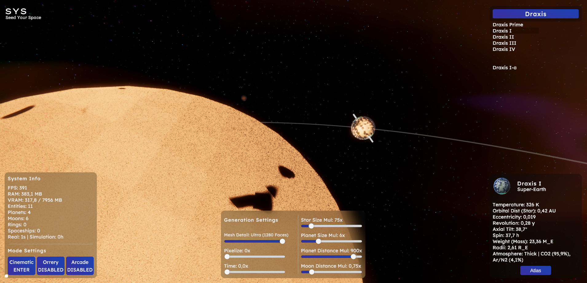

  

# SYS - Seed Your Space 🌌

**A High-Fidelity, Deterministic Star System Builder for Unity URP**

 

> **🎓 Academic Note:** This repository contains the source code for a Bachelor's Degree thesis project in Computer Science (_Tesi di Laurea Triennale in Informatica_).

## 🔭 Overview

**SYS** is a procedural space diorama builder and astrophysics engine forged in Unity 6 using the Universal Render Pipeline (URP). It transmutes deterministic seeds into fully realized, visually 3D star systems. The engine dynamically orchestrates central stars, planets, moons, and asteroid belts, driven by a rigorous framework of astrophysical rules and stochastic mathematics.

Designed to seamlessly blend high visual fidelity with blockchain technology, the architecture guarantees that a single master seed will consistently generate the exact same cosmic layout, ensuring absolute backward compatibility across different generation algorithm versions.

## ✨ Key Features

### 🌌 Procedural Astrophysics Engine

- **Deterministic Generation:** Relies on robust fundamental classes to derive consistent numerical seeds from alphanumeric strings.
- **Accurate Orbital Mechanics:** Calculates realistic orbital distances, eccentricities, and orbital inclinations based on astrophysical models.
- **Habitability & Atmospherics:** Determines planetary classes (Gas Giants, Ice Giants, Terrestrial), calculates surface temperatures via frost lines, and deduces atmospheric compositions.

### 🎨 High-Fidelity Rendering (URP)

- **Stellar Surfaces:** Procedural Voronoi granulation shaders bring churning stellar plasma to life.
- **Planetary & Lunar Topography:** Advanced procedural shaders dynamically generate consistent surface biomes based on underlying planetary data.
- **Atmospheric Auroras:** Worlds with specific magnetic and atmospheric conditions display dynamic polar auroras.
- **Cosmic Skybox & Nebulae:** Features a fully procedural skybox enriched with nebulae.
- **Procedural Meshes:** Custom Icosphere generators for celestial bodies optimize vertex distribution, entirely preventing polar distortion artifacts.
- **Ring Systems:** Procedural generation of intricate planetary and lunar rings.

### 🕹️ Interactive Simulation & View Modes

- **Cinematic Mode 🎥:** Hides the UI and engages a smooth, automated camera orbit around selected celestial bodies for a breathtaking showcase.
- **Orrery Mode 🧭:** Projects navigational orbital lines and rotational axes directly into the 3D space to visualize the system's mechanics.
- **Arcade Mode 🚀:** Populates the system with procedural spaceships actively shuttling between planets. _(Thanks to [Kenney](https://kenney.nl/) for the Space Kit assets used here!)_
- **Temporal Control ⏳:** Granular time manipulation allows users to freeze the simulation entirely or accelerate cosmic time up to 100x.
- **Planetary Atlas & UI 🗺️:** Interacting with any celestial body reveals detailed astrophysical data and unfolds an interactive 2D atlas map, directly mirroring the 3D procedural mesh.
- **Retro Pixel Filter 👾:** A custom URP Scriptable Render Feature that applies a scalable pixelation effect (up to 10x intensity) for a nostalgic, low-res aesthetic.

## 🔗 Web3 & Blockchain Integration

SYS is engineered to operate seamlessly with the Ethereum blockchain, currently deployed on the **Sepolia Testnet**. The architecture fiercely embraces the philosophy of "minimal on-chain data, maximal off-chain fidelity."

### 📝 Smart Contract Architecture

The custom ERC-721 enumerable smart contract (`SeedYourSpace.sol`) orchestrates a secure, asynchronous **Request-Fulfill-Claim** pipeline to guarantee true on-chain randomness while protecting users from transaction reverts.

- **Request:** Users initiate minting by covering a fixed ETH fee, which locks their address in an active mapping to prevent queue saturation.
- **Fulfill (Chainlink VRF v2.5):** The oracle securely returns quantum-derived entropy. The contract caches the raw seed deterministically.
- **Claim:** The user triggers a gas-only transaction to safely mint the NFT containing the verified seed and the active `algorithmVersion` snapshot.

### 🎨 100% On-Chain Generative SVG Art

To ensure permanence without relying on external IFPS gateways, the contract acts as a generative artist. It mathematically hashes the Chainlink seed to deterministically select a color palette and render a clean, 5x5 pixel-art SVG preview of the solar system directly into the `tokenURI`.
Unity dynamically queries this SVG off-chain, parses the color data, and reconstructs the pixel-art asset natively in the C# UI inventory.

## 📦 Prerequisites & Dependencies

The project is built on **Unity 6000.3.22f1** and utilizes the following major packages:

- **Unity Core Packages:**
  - Universal Render Pipeline (URP) `17.3.0`
  - Visual Effect Graph `17.3.0`
  - Shader Graph `17.3.0`
  - Burst `1.8.30`
  - Mathematics `1.3.3`
  - Input System `1.20.0`
- **Third-Party & Web3 Packages:**
  - [Nethereum](https://nethereum.com/) `6.1.0` (for Web3/RPC smart contract communication)
  - Unified Blur `0.9.0` (by Luka Kldiashvili)

## 📄 License

The Unity Engine Application and C# source code is licensed under the **GNU Affero General Public License v3.0 (AGPL-3.0)**.
The Solidity Smart Contract (`SeedYourSpace.sol`) is released under the **MIT License**.

See the [LICENSE](LICENSE) file for more details.
